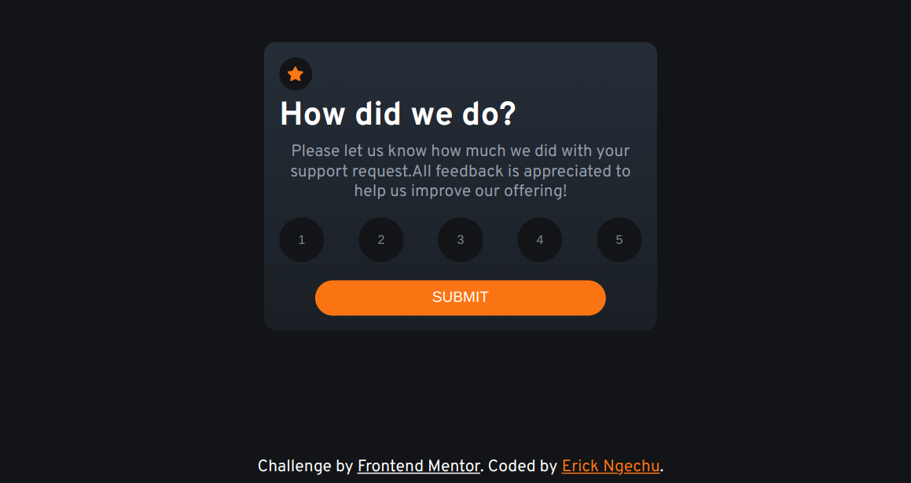
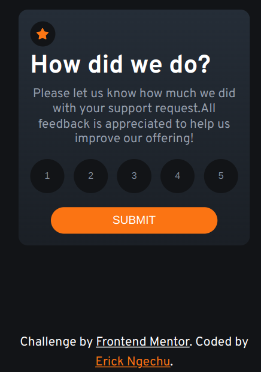
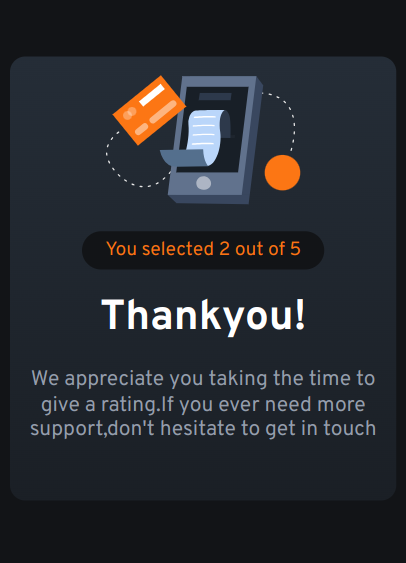

# Frontend Mentor - Interactive rating component solution

This is a solution to the [Interactive rating component challenge on Frontend Mentor](https://www.frontendmentor.io/challenges/interactive-rating-component-koxpeBUmI). Frontend Mentor challenges help you improve your coding skills by building realistic projects.

## Table of contents

- [Overview](#overview)
  - [The challenge](#the-challenge)
  - [Screenshot](#screenshot)
  - [Links](#links)
- [My process](#my-process)
  - [Built with](#built-with)
  - [What I learned](#what-i-learned)
  - [Continued development](#continued-development)
  - [Useful resources](#useful-resources)
- [Author](#author)
- [Acknowledgments](#acknowledgments)

## Overview

### The challenge

Users should be able to:

- View the optimal layout for the app depending on their device's screen size
- See hover states for all interactive elements on the page
- Select and submit a number rating
- See the "Thank you" card state after submitting a rating

### Screenshot

The following screenshots shows both the mobile and desktop version of the project.




### Links

- Solution URL: [Source code](https://github.com/Rickyngechu/Frontendmentour-2)
- Live Site URL: [Netlify live web](https://your-live-site-url.com)

## My process

### Built with

- Semantic HTML5 markup
- CSS custom properties
- Flexbox
- Responsive web design.
- Mobile-first workflow

**Note: These are just examples. Delete this note and replace the list above with your own choices**

### What I learned

Since I had learned about javascript timeout function,having to put into practice what I learned was the most intresting thing that I learned throughout the project.

```js
const setTimeout = () => {
  console.log("🎉"), 1000;
};
```

### Continued development

I will continue perfecting my DOM manipulation skills and handling form data using javscript in general.

### Useful resources

- [Tools](Jonas.io/resources) - This helped me for color and web testing tools. I really liked this pattern and will use it going forward.

- [Tools](https://developer.mozilla.org/en-US/docs/Web/API) - This is mozzila developer network for web developer documentation of html css and js.

## Author

- Website - [Erick Ngechu](https://rickyportf.netlify.app)
- Frontend Mentor - [@Rickyngechu](https://www.frontendmentor.io/profile/Rickyngechu)
- Twitter - [@Ricky_101com](https://twitter.com/@Ricky_101com)

## Acknowledgments

I would like to acknowlegde Jonas schmedtman for the great skills he has offered me in his javascript courses.Furthermore I would like to pass my gratitude towards Kevin powell a great css master who has sharpened my css skills and responsive web design in general.
